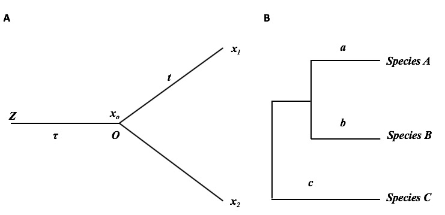
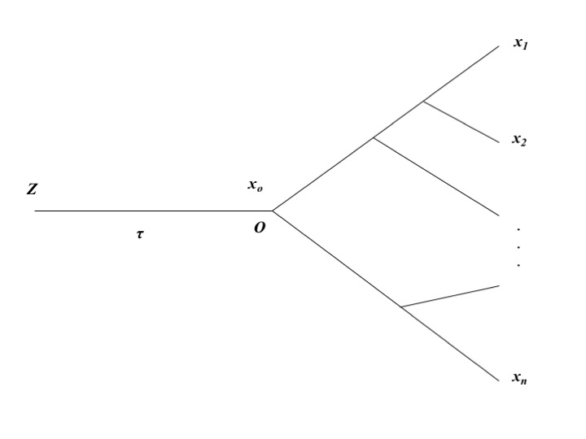
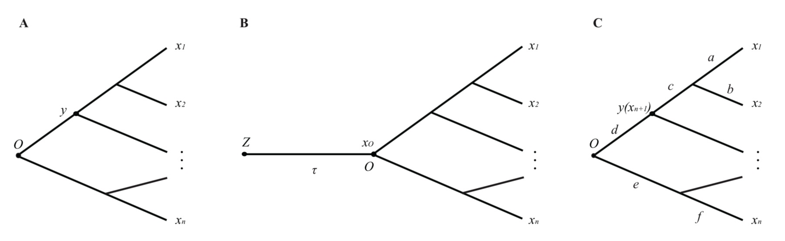

```{r setup, include = FALSE}
knitr::opts_chunk$set(
  collapse = TRUE,
  comment = "#>"
)
```

\newpage

# Introduction
## Scope
This guide provides an brief overview of the package *TreeExp* which is developed to provides useful phylogenetic tools applicable to RNA-seq data.

Statistical methods implemented in the package was based on Ornstein-Uhlenbeck (OU) model of transcriptome evolution which claims that expression changes are constrained by stabilizing selection.

The package can be applied to comparative expression evolution analysis based on RNA-seq data, which includes but not liminited to:

* pairwise expression distance estimation
* relative rate test for transcriptome evolution
* the strength of expression conservation estimation
* ancestral transcriptome inference

This guide begins with brief description of the input data manipulation and storage and then gives key capabilities of package. Each main feature of the package consists of two parts: biological model and fully worked case studies for real data.

\newpage

## Installation
A convenient way to install package from github is through *devtools* package:

```{r, eval=FALSE}
install.packages('devtools')
devtools::install_github("jingwyang/TreeExp")
```

After installation, *TreeExp* can be loaded in the usual way:

```{r, eval=FALSE}
library('TreeExp')
```

\newpage

## Citation
The *TreeExp* package implements statistical methods from the following publications. If you use *TreeExp* in publised research, please cite the appropriate articles

```{}
Ruan,H. et al. (2016) TreeExp1.0: R package for analyzing expression 
evolution based on rna-seq data. Journal of Experimental Zoology Part B: 
Molecular and Developmental Evolution, 326, 394–402.
```

* This paper [@doi:10.1002/jez.b.22707] released the 1.0 version of *TreeExp* that can perform comparative expression evolution analysis based on RNA-seq data, which include optimized input formatting, normalizeation, pairwise expression distance estimation, expression character tree inference, and prliminary expression phylogenetic network analysis.

```{}
Yang,J. et al. (2018) Ancestral transcriptome inference based on
rna-seq and chip-seq data. Methods.
```

* This paper[@YANG2018] reported an updated verson of ancestral state inference originally developed by [@gu2004]. With special reference to the transcriptome evolution, the algorithm implemented is feasible, which can deal with RNA-seq and ChIP-seq data.

```{}
Gu, Xun, Hang Ruan, and Jingwen Yang. 2019. “Estimating the Strength of 
Expression Conservation from High Throughput RNA-seq Data.” Bioinformatics, May.
```

* This paper [@10.1093/bioinformatics/btz405] developed a gamma distribution model to describe how the strength of expression conservation (denoted by W) varies among genes. Given the high throughput RNA-seq datasets from multiple species, we have formulated an empirical Bayesian procedure to estimate W for each gene.

\newpage

## How to Get Help?
Each function in *TreeExp* has online help page. If users have a question about a particular function, reading the function’s help page will be very useful. For example, a detailed description of the arguments and output of the *RelaRate.test* function can be read by typing

```{r, eval=FALSE}
?RelaRate.test()
```
or 
```{r, eval=FALSE}
help(RelaRate.test)
```
at R console. Users can also read the tutorial file embeded in the package to have more detailed information about the pacakge.

It seems that vigenette file was not build by default when installing the pacakge from github through *devtools* package.Before we can check the vigenettes, we should build it first.

One way is to build it when we install the package:

```{r, eval=FALSE}
devtools::install_github('jingwyang/TreeExp',build_opts = c("--no-resave-data", "--no-manual"))
```

Then we can list available vigenettes in an HTML browser through `browseVignettes` function:

```{r, eval=FALSE}
browseVignettes('TreeExp')
```


Besides, authors are appreciated to recieve reports of bugs in the functions or well-considered suggestions for improvements for the package. 

\newpage

## RNA-seq Data Enbeded
RNA-seq datasets used in cased studies (brain, cerebellum, heart, liver, kidney and testis) were collected from the work of [@brawand2011], each of which include eigth species: Human (*Homo sapiens*), Chimpanzee (*Pan troglodytes*), Orangutan (*Pongo abelii*), Macaque (*Macaca mulatta*), Mouse (*Mus musculus*), Platypus (*Ornithorhynchus anatinus*), Opossum (*Monodelphis domestica*) and Chicken (*Gallus gallus*).

Single expression value for each gene per species was obtained by taking the median of TPM (Transcripts per Million) among biological replicates.


\newpage

# Data Manipulation and Storage
## Input Format
To simplify the use of package, the updated *TreeExp* has gave up the former input format (which require both gene information file and reads count data) and takes in only normalized RNA-seq data as input file. In other words, users should make sure that the input data is processed and comparable between samples. The package is not likely to provied data filteration or normalization functions.

The expression data is suppossed to be in certain format:

1. expression file should be a `text` file in matrix shape, in which values are separated by tabs. `Rows` correspond to orthologous genes names, and `Columns` correspond to sample names. Sample names are in format of "`TaxaName_SubtaxaName_ReplicatesName`". Usually, `TaxaName` represents name of species; `Subtaxaname` correspond to cetain tissue, celltype or develomental stage; `ReplicatesName` shows the name of replicates for each `Taxa_Subtaxa`-pair. The three types of lables, `TaxaName`,`SubtaxaName`, `ReplicatesName` are connected by '`_`' character.

2. raw reads count data should be first normalized, e.g., by RPKM. While RPKM is simple and straightforward, it tends to be unstable when the number of genes expressed across samples differs considerably. This problem can be alleviated by the TPM measure, which has been widely usued. Some statistically sophisticated normalization methods such as TMM, and median ratio normalization, has become the built-in standard in many bioinformatics tools for RNA-seq analysis[@robinson2010].

## Example of Input Data
The example file are included in the *TreeExp* package, which can be found in `/inst/extdata` folder in the package. 

Here, we select expression values of 100 orthologous genes in eight brain regions (CB, HIP, STR, ACC, V1C, PMC, DPFC, VPFC)^[cerebellum (CB), hippocampus (HIP), striatum (STR) ,  anterior cingulate cortex (ACC),  primary visual cortex (V1C), premotor cortex (PMC),  dorsolateral prefrontal cortex (DPFC),
ventrolateral prefrontal cortex (VPFC).] among human, chimpanzee, gorilla and gibbon[@xu2018].
The numbers of biological replicates for each of the brain regions in species are 2~6, except only one replicate for all brain regions in gibbon.
Note that expression data here are only used as demonstration of how functions in package store, manipulate and print the data input, and should not be used in further phylogenetic analysis since too few genes were included in the file.

The Table below shows the format of the partly input data.

```{r,echo=FALSE, results='asis',message=FALSE}
library('TreeExp')
data('example_data')
knitr::kable(example_data)
```

## Construction

The construction function `TEconstruct` loads in expression level file, and wraps it in a list of *taxonExp* objects (one *taxaExp* object).
```{r, eval=FALSE}
taxa.objects = TEconstruct(ExpValueFP = system.file('extdata/primate_brain_expvalues.txt',
package = 'TreeExp'), taxa = "all", subtaxa = 'all')
```

The construction process takes **several minutes** on a desktop computer depending on data size and hardware performance. Specify **"taxa"** and **"subtaxa"** options in the function when using partial of your data. The construction process will be faster.
```{r,message=FALSE,results='hide'}
taxa.objects = TEconstruct(ExpValueFP = system.file('extdata/primate_brain_expvalues.txt',
package = 'TreeExp'), taxa = "all", subtaxa = c("ACC","CB"))
```
You can take a look at what the loaded objects:
```{r}
print(taxa.objects, details = TRUE)
```
Also, you can choose to print a single *taxonExp* object
```{r}
print(taxa.objects[[1]], printlen = 6)
```
and choose to print single element (*exp_val*(expression values) element as example) for the *taxonExp* object
```{r,eval=FALSE}
taxa.objects[[6]]$exp_value[1:5,]
```
```{r, results='asis', echo=FALSE}
knitr::kable(taxa.objects[[6]]$exp_value[1:5,])
```

Once the contruction courcs successfully completed, the following transcriptome phylogenetic analysis are ready to go.

\newpage

# Pairwise Expression Distance and Expression Tree-Making
## Theory
### The Ornstein-Uhlenbeck (OU) model of transcriptome evolution 
It is generally believed that the expression level of a gene, denoted by $x$, is subject to the stabilizing selection to maintain the optimum during the course of evolution. Consequently, the motion of the expression level ($x$) can be described by the so-called Ornstein-Uhlenbeck (OU) process[@hansen1996@bergmann2004@butler2004]. Briefing speaking, while the random force driving the expression level away from the optimum, the deterministic force will pull the expression level back to the optimum. It has been shown that the distribution density of $x$ after $t$ time units since the initial value $x_0$, denoted by $OU\left(x\mid x_0,\theta\right)$, is normal with the mean $E\left[x\mid x_0\right]$and variance $V\left(x\mid x_0\right)$ given by

$$
\begin{split}
E\left[x\ \mid\ x_0\right]\ &=\ \mu\left(1-e^{-\beta t}\right)\ +\ z_0e^{-\beta t} \\
V\left[x\ \mid\ x_0\right]\ &=\frac{1-e^{-2\beta t}}{W}
\end{split}\tag{1.1}
$$

respectively, where  $\theta$ is for the parameter vector: $\mu$ is the optimal expression value,  $\beta$ the rate of expression evolution, and $W$ the strength of expression conservation.


### Transcriptome evolution between species 
Consider a simple two-stage scenario of transcriptome evolution that consists of two species that diverged $t$ time units ago (**Figure 1A**). 

```{r, echo=FALSE, fig.cap="Figure1. The schematic of transcriptome evolution along a phylogeny", out.width = '90%'}

```

The first stage is the evolutionary lineage from the tissue ancestor (denoted by node $Z$) to the common ancestor of two species (denoted by node $O$), with a span of $\tau$ evolutionary time units. Given the initial expression value $z_0$ at node $Z$, the density of $x_0$ (the ancestral expression level at node $O$) is given by $OU\left(x\mid x_0,\ \theta_0\right)$ where the parameter vector $\theta_{0}=\left(\mu,\ \beta\tau,\ W\right)$. 

In the second stage, let $x_1$ and $x_2$ be the expression levels of an orthologous gene pair, respectively. Given the ancestral expression level ($x_0$) at node $O$, the density of $x_1$ follows $OU\left(x_1\mid x_0;\ \theta_{1}\right)$, and that of $x_2$ follows $OU\left(x_2\mid x_0;\ \theta_{2}\right)$, respectively, where $\theta_{1}=\left(\mu,\ \beta_{1}t,\ W_{1}\right)$ and $\theta_{2}=\left(\mu,\ \beta_{2}t,\ W_{2}\right)$. If transcriptome evolution is independent between lineages, the joint density of $x_1$ and $x_2$ conditional of $x_0$ is simply given by $P\left(x_1,\ x_2\ \mid\ x_0\right)=OU\left(x_1\mid x_0;\ \theta_1\right)OU\left(x_2\mid\ x_0;\ \theta_2\right)$. Since $x_0$ follows the density $\pi\left(x_0\right)=OU\left(x_0\mid z_0;\ \theta_{0}\right)$, one can show that the joint density of $x_1$ and $x_2$  

$$P\left(x_1,x_2\right)=\int_{-\infty}^{\infty}P\left(x_1,x_2\mid x_0\right)\pi\left(x_0\right)dx_0\tag{1.2}$$
follows a normal distribution, with the mean vector 
$$
\begin{split}
E\left[x_1\right]&=\mu\left(1-e^{\beta_1t}\right)+\left[\mu\left(1-e^{\beta_0\tau}\right)+z_0e^{\beta_0\tau}\right]e^{-\beta_1t} \\
E\left[x_2\right]&=\mu\left(1-e^{\beta_2t}\right)+\left[\mu\left(1-e^{\beta_0\tau}\right)+z_0e^{\beta_0\tau}\right]e^{-\beta_2t} 
\end{split}\tag{1.3}
$$

and the variance-covariance matrix $\boldsymbol{V}$given by

$$
\begin{split}
V_{11}&=\frac{1}{W_1}+\left(\rho^2-\frac{1}{W_1}\right)e^{-\beta_1t}\\
V_{22}&=\frac{1}{W_2}+\left(\rho^2-\frac{1}{W_2}\right)e^{-\beta_2t}\\
V_{12}&=\rho^2e^{-\left(\beta_1+\beta_2\right)t}
\end{split}
\tag{1.4}
$$

where $\rho^2=V\left(x_0\mid\ z\right)=\frac{\left(1-e^{-\beta\tau}\right)}{W}$ is the variance of $x_0$ at root $O$.

### The estimation problem of expression distance 
Consider two RNA-seq datasets of the same tissue from species-1 and species-2, respectively, which include $N$ orthologous genes. For the $k$-th orthologous pair, let $x_{k,1}$ and $x_{k,2}$ be the expression levels, respectively,$k=1,\cdots,N$. It is straightforward to calculate the expression variances and their covariance, denoted by $Var(X_1)$, $Var(X_2)$ and $Cov(X_1, X_2)$, respectively. Meanwhile, the last equation of Eq.(1.4) shows that, theoretically, the expression covariance between species ($V_{12})$ decays exponentially with the component ($\beta_1+\beta_2$), providing a foundation to define the expression distance between two species by
$$D_{12}=\left(\beta_1+\beta_2\right)t=2\beta t\tag{1.5}$$
where $\beta=\frac{\left(\beta_1+\beta_2\right)}{2}$ is the rate of expression evolution (averaged over two lineages). However, the difficulty to estimate $D_{12}$ is two-folds

* the ancient variance ($\rho^2$) at root $O$ is usually unknown.
* equations in Eq.(4) are valid only when the optimal expression level ($\mu$) is constant among genes. We address these issues as follows.

### Estimation of expression distance under the stationary OU model
We invoke the stationary OU process (sOU) to estimate the unknown ancestral variance $\rho^2$. It has two assumptions: 

1. the evolutionary span ($\tau$) between the tissue ancestor ($Z$) and the species ancestor ($O$) is so large that the variance at root $O$ approaches to $\rho^2=1/W$;
2. after the speciation, the strength of expression conservation ($W$) remain constant between species. Under the constant-$\mu$ assumption, from Eqs.(1.3) and (1.4) we then have $E\left[x_1\right]=E\left[x_2\right]=\mu$, $V_{11}=V_{22}=\frac{1}{W}$, as well as the last equation of Eq.(1.4) by 
$$V_{12}=\frac{e^{-2\beta t}}{W}\tag{1.6}$$
After calculating the Pearson coefficient of expression correlation, $r_{12}=\frac{Cov\left(X_1,X_2\right)}{\sqrt{Var\left(X_1\right)Var\left(X_2\right)}}$, we obtain a simple formula for estimating the expression distance, that is,
$$D_{12}=-\ln\left(r_{12}\right)=-\ln\left(1-P_{12}\right)\tag{1.7}$$
When $r_{12}$ is close to 1 in the case of closely-related species, $D_{12} \approx 1- r_{12}$, i.e., the Pearson distance $P_{12}=1- r_{12}$. 

### Expression distance estimation when expression optima vary among genes
While expression distance estimation based on Eq. (1.7) is intuitively simple, we have realized that the implied constant-$\mu$ assumption is unrealistic. Because the optimal expression level ($\mu$) actually varies considerably among different genes, neglecting this variation may lead to an underestimation. Here we develop a new method to correct this bias. 

Suppose that $\mu$ varies among genes according to a normal distribution with mean zero and variance $V_{\mu}$. Under the stationary OU model, we can extend Eq.(1.4) as follows: 

the expression variances are given by $V_{11}=V_{22}=1/W+V_{\mu}$ and the covariance by
$$V_{12}=\frac{e^{-2\beta t}}{W}+V_{\mu}\tag{1.8}$$
It follows that the Pearson coefficient of correlation $r_{12}=\frac{V_{12}}{\sqrt{\left[V11,\ V22\right]}}$ can be written as
$$r_{12}=\frac{\left(e^{-2\beta t}+WV_{\mu}\right)}{\left(1+W_{\mu}\right)}=\pi+\left(1-\pi\right)^{e^{-2\beta t}}\tag{1.9}$$
where $\pi=\frac{WV_{\mu}}{\left(1+WV_{\mu}\right)}$, which measures the relative $\pi=0$ means among genes. While $\pi=0$ means a constant-$\mu$ among genes, $\pi=1$ means indicates a very strong $\mu$ variation among genes. $r_{12}\rightarrow\pi$ as $t\rightarrow \infty$. From Eq.(9) we obtain a general formula to estimate the express distance $D_{12}=2\beta t$ as follows
$$D_{12}=-\ln\frac{\left(r_{12}-\pi\right)}{\left(1-\pi\right)}=-\ln\left[1-\frac{P_{12}}{1-\pi}\right]\tag{1.10}$$
where $P_{12}=1-r_{12}$ is the Pearson distance. Apparently, Eq.(1.10) is reduced to Eq.(1.7) when $\pi=0$.

### Estimation of $\pi$
When Eq.(1.10) is applied in the evolutionary analysis of RNA-seq data, we have to know the parameter $\pi$, which can be estimated when RNA-seq data of the same tissue from $n>=3$ species are available. 

Let $x_k=\left(x_{1k},\cdots x_{nk}\right)$ be the across-species expression profile of the $k$-th orthologous gene; $k=1,\cdots N$. 

We first calculate the mean expression level of each $k$-th orthologous gene, denoted by $x_{.k}$, and then calculate the variance, $Var\left(x_.\right)$, of $x_{.k}$ over all $N$ genes. It appears that $Var\left(x_.\right)$ is an asymptotically unbiased estimate of $V_\mu$. Next, the strength of expression conservation ($W$) can be estimated by a simple method in the following part. 

It follows that $\pi$ can be estimated by

$$\pi=\frac{Var\left(x_{.}\right)W}{1+WVar(x_.)}\tag{1.11}$$
\newpage

## Case Study: Expression Tree Building
In here, we will give an example to build a character tree from expression data (expression phylogeny) applying the above-mentioned methods.

*TreeExp* can be loaded in usual way:

```{r, warning=FALSE}
library(TreeExp)
```

We first load the datasets created from six tissues' expression data of nine tetrapod species
```{r}
data("tetraExp")
```
### Distance matrix
First, we generate an expression distance matrix of these nine tetrapod species:
```{r, message=FALSE}
dismat_pea <- expdist(tetraExp, taxa = "all",
                 subtaxa = "Brain",
                 method = "pea")
as.dist(dismat_pea)
```

`expdist` function can calculate expression distance directly through the *taxaExo* object. It will extract the expression values and $log2$-transform the values according to the **"taxa"** and **"subtaxa"** specified in the options.

The default method *"pea"* is to calculate pair-wise distances by Pearson distance, which equals 1-Pearson’s coefficient of expression level. 

Besides *"pea"* , there are numbers of alternative methods to calculate pair-wise expression distances, like*"sou", "sou_v","pea", "spe","euc", "cos", "jsd", "tani", "jac"*. 

Of particular, **"sou"** means the general sOU distance method and **"sou_v"** means the special sOU model when expression optima vary among genes that we introduced above.

For comparison, we apply **"pea"**,**"sou"**and **"sou_v"** methods to calculate the paired expression distances between species.

Distance matrix applying **"sou"** method:
```{r, message=FALSE}
dismat_sou <- expdist(tetraExp, taxa = "all",
                 subtaxa = "Brain",
                 method = "sou")
as.dist(dismat_sou)
```
Distance matrix applying **"sou_v"** method:
```{r, message=FALSE}
dismat_sou_v <- expdist(tetraExp, taxa = "all",
                 subtaxa = "Brain",
                 method = "sou_v")
dismat_sou_v$pi
as.dist(dismat_sou_v$distance)
```

Note that method **"sou_v"** will return an object of *list* which contains two element. The firt one is the estimated value of parameter $\pi$. The second one is the distance matrix using **"sou_v"** method.
```{r, message=FALSE}
dismat_sou_v$pi
```
Comparing the distance values calculted by the three methods, we can approximately draw a conclusion that while the optimal expression level($\mu$) actually varies considerably among different genes, neglecting this variation may lead to an underesitmation of expression distance.

Also, if you already have a data frame with normalized expression values, there are internal functions available for creating expression distance matrix.

Function `exptabTE` is helpful to generate an expression level table from the *taxaExp* object and $log2$-transform the values. Also, **"taxa"**" and **"subtaxa"**" can be set by users.
For instance, 
```{r, eval=FALSE}

expression_table <- exptabTE(tetraExp, taxa = "all",
                            subtaxa = "Brain")

dismat <- dist.pea(expression_table)
dismat <- dist.sou(expression_table)
dismat <- dist.sou_v(expression_table)
```

If you have your own expression data frame in the format as the "expression_table" here, it will do fine:

```{r, eval=FALSE}

dismat <- dist.pea(your_own_dataframe)
colnames(dismat) <- colnames(your_own_dataframe)
rownames(dismat) <- colnames(dismat)

```

\newpage

### Expression character tree
After the expression distance matrix is created, we can construct character tree by Neighbor-Joining method, and bootstrap values based on re-sampling orthologous genes with replacements can also be generated by `boot.exphy` function:

```{r, message=FALSE, warning=FALSE, results='hide', fig.height=4, fig.width=6}
library('ape')
 ##### build NJ tree
tr <- NJ(dismat_sou)
 ### estract expression table of Brain tissue from 'tetraExp'
expression_table <-exptabTE(objects = tetraExp,taxa = 'all',
                            subtaxa = 'Brain')
### root the tree using 'Chicken_Brain' as outgroup
tr <- root(tr, "Chicken_Brain", resolve.root = TRUE) 
###### generating bootstrap values of the tree
bs<-boot.exphy(phy=tr, x = expression_table, method = 'sou',
               outgroup = 'Chicken_Brain', B = 100) 
### assign bootstrap values to the "node.label" of the tree
tr$node.label = bs 
### plot the tree
plot(tr, show.node.label = TRUE)
```

Note that the goal of `root` step is to give an better interpretation on the phylogentic relationships of trascriptome data. 

Essentially, the tree build by NJ method itself is an unrooted tree. Though `root` function adds a 'root' node to the tree, the branch length between root node and its neighbor internal node is still 0. In other words, `root` step may be only for tree presentation, and it is not needed when a phylogentic tree should be used as input parameter in the following analysis (such like *Ancestral Transcriptome Inference*).

By now, an expression character tree is successfully constructed. The tree shows expression patterns' similarities in selected genes of designated species. The expression tree is largely in accordance with species tree with minor discrepancy. 

Phenomenon of evolutionary history dominates the evolutionary expression pattern can be described as phylogenetic signals. One way to interpret highly consistent expression character tree is that expression levels of transcriptome, representing the regulatory changes, accumulated over time. Though not as concrete as sequence data, expression levels generated from transcriptome data across species show strong phylogenetic signals.

\newpage

# Relative Rate Test for Transcriptome Evolution
## Theory
Given a set ($N$) of orthologous genes of two species denoted by $A$ and $B$, respectively, the goal of relative rate test is to investigate whether the rate of transcriptome evolution, on average, differs significantly between two lineages of species $A$ and $B$. To this end, we need the third species (species $C$) as outgroup (**Figure 1B**). 

Let $D_{AB}$, $D_{AC}$ and $D_{BC}$ be the pairwise expression distances, respectively, which can be estimated by the methods we formulated above. Let $a$, $b$, $c$ be the expression branch lengths of corresponding three lineages $A$, $B$ and $C$, respectively. Assuming that these expression distances are additive, we have 

$$
\begin{split}
D_{AB}&=a+b \\
D_{AC}&=a+c \\
D_{BC}&=b+c
\end{split}\tag{2.1}
$$

respectively. Since lineages $A$ and $B$ have the same evolutionary time ($t$), one may write $a=\beta_At$ and $b=\beta_Bt$, where $\beta_A$ and $\beta_B$ are the rates of transcriptome evolution in lineages $A$ and $B$, respectively. 

The relative rate test considers the following statistic
$$G_{AB}=D_{AC}-D_{BC}=a-b=\left(\beta_A-\beta_B\right)t\tag{2.2}$$

Hence, the null hypothesis $G_{AB}=0$ or $D_{AC}=D_{BC}$ means an equal rate ($\beta_A=\beta_B$) of expression divergence between two lineages. Rejection of this null indicates a rapid expression evolution in lineage $A$ ($\beta_A>\beta_B$ if $G_{AB}>0$) or in lineage $B$ ($\beta_A>\beta_B$ if $G_{AB}<0$). 

Here, we apply a Z-score test to examine the signigicance

$$Z\ =\ \frac{\bigtriangleup_{AB}}{\sqrt{Var\left(\bigtriangleup_{AB}\right)}}\tag{2.3}$$

where $\bigtriangleup_{AB}$ equals to $G_{AB}$.

\newpage

## Statistical Procedure of the Relative Rate Test
### Sampling variance of the expression distance 
 In practice, calculating the sampling variance for the estimated coefficient ($r$) of correlation is usually carried out using the Fisher transformation, the inverse hyperbolic (artanh) of $r$, that is, $F\left(r\right)=0.5\ln\left(\frac{1+r}{1-r}\right)$. It follows that $F(r)$ approximately follows a normal distribution with $F(\rho)$ and the variance of $\frac{1}{N-3}$, where $\rho$ is the true value of the coefficient of correlation and $N$ is the sample size.  With the delta method, the inverse Fisher transformation brings the sampling variance back to the correlation scale, resulting in $Var\left(r\right)=\frac{\left(1-r^2\right)^2}{N-3}$. Consider the general expression distance given by Eq.(1.11). By the delta method, the large-sampling variance of $D_{12}$ is approximately given by
$$Var\left(D_{12}\right)=\frac{Var\left(r_{12}\right)}{\left(r_{12}-\pi\right)^2}\tag{2.4}$$

### Calculation of $Var(\bigtriangleup_{AB})$ 
Since $\bigtriangleup_{AB}=D_{AC}-D_{BC}$, we have $Var(\bigtriangleup_{AB})=Var(D_{AC})+Var(D_{BC})-2Cov(D_{AC}, D_{BC})$. Moreover, we notice that the sampling covariance equals to $Cov(D_{AC}, D_{BC})=Var(c)$, as branch-$c$ is the one shared by those two distances. We develop a simple method to calculate $Var(c)$.

1. First, the branch length can be estimated by $c=\frac{(D_{AC}+D_{BC}-D_{AB})}{2}$.
2. we calculate a new variable $r_c=\pi+(1-\pi)e^{-c}$. After viewing $r_c$ as the estimated coefficient of correlation between species $C$ and the ancestral node $O$, by the Fisher transformation we obtain $Var(c)=\frac{(1-r_c^2)^2}{(N-3)}$. While two sampling variances $Var(D_{AC})$ and $Var(D_{BC})$ can be obtained directly from Eq.(2.4), together we have 

$$Var\left(\bigtriangleup_{AB}\right)=\frac{Var\left(r_{AC}\right)}{\left(r_{AC}-\pi\right)^2}+\frac{Var\left(r_{BC}\right)}{\left(r_{BC}-\pi\right)^2}-\frac{2Var\left(r_c\right)}{\left(r_c-\pi\right)^2}\tag{2.5}$$
\newpage

## Case Study: Testing Fast-evolving Genes in Human
In general, relative rate test is to investigate whether the expression of a given gene set in species A is fastly evolved  than that in species B. Typically, the gene set chosen to perform the test is set by users and is only a small part of all one-to-one orthologous genes (several hundreds). Moreover, the gene set usually have some specific biological characteristics, such like gene set from a GO term or a co-expression module.

In the case study,  we choose gene set with row numbers between 200 to 800 to exemplify how relative rate test works.

At first, we shall extract the gene expression values of brain tissue from the  *tetraExp* object. 

Parameter `rowindex` defines which genes are selected to perfome the test. Usually, `rowindex` is a vector of numbers corresponded to indices of selecting rows or a vector of logical values (TRUE or FALSE) indicating whether to select the corresponding row or not.

```{r, warning=FALSE, message=FALSE}
#### load the tetraExp data firstly
data(tetraExp)
### extract the gene expression values of the selected genes from 'tetraExp' object.
exp_table <-exptabTE(tetraExp, taxa = 'all', subtaxa = 'Brain',rowindex = 200:800)
```

After obtaining the expression table, performing relative rate test is straightforward by function `RelaRate.test`. It will extract the gene expression value of species $A$ (human), species $B$ (chimpanzee) and outgroup $C$ (macaque) from the  *exp_table* and will return a list of three elements. The first one is the $Z$-score value of the relative rate test, the second is the value of parameter `alternative`, and the last one is the $p$-value under the specified alternative hypothesis.

```{r, warning=FALSE, message=FALSE}
ztest <- RelaRate.test(expTable = exp_table, x = 'human', y = 'chimpanzee',
                       outgroup = 'macaque', alternative = 'greater')
ztest
```
So, using macaque as an outgroup, the expression of geneset with row numbers between 200 and 800 in human is not likely to evolved significantly faster than that in chimpanzee ($p$-value >0.05).

\newpage

# Estimating the Strength of Expression Conservation
## Theory
### Stabilizing selection model in transcriptome evolution across species
The Ornstein-Uhlenbeck (OU) model, which claims that expression changes are constrained by the stabilizing selection, is biologically more realistic than a simple Brownian motion (BM) model[@rohlfs2014@lemos2005@gu2007@bedford2009@brawand2011].

Intuitively speaking, the OU model includes two opposite processes: 

* random mutations push the expression level ($x$) of a gene away from the optimum ($\mu$), a process may suffer from a fitness reduction;
* the return process to the expression optimum ($\mu$) driven by a positive selection; the strength of this ‘elastic’ return increases proportionally with w, the coefficient of stabilizing selection. Given the initial expression value ${x_0}$, the OU model predicts that $x\left(t\right)$, the expression level after $t$ evolutionary time units, follows a normal distribution with the mean $E\left[x\ \mid\ x_0\right]$ and variance $V\left[x\ \mid\ x_0\right]$ 

$$
\begin{split}
E\left[x\ \mid\ x_0\right]\ &=\ \mu\left(1-e^{-\beta t}\right)\ +\ z_0e^{-\beta t} \\
V\left[x\ \mid\ x_0\right]\ &=\frac{1-e^{-2\beta t}}{W}
\end{split}\tag{3.1}
$$

respectively, where $\beta$ is the rate of expression evolution and W is the strength of expression  conservation; symbolically one may write  an OU process by $OU\left(x\ \mid\ x_0;\ \theta\right)$, where $\theta\ =\ \left(\mu,\ \beta t,\ W\right)$ is the parameter vector. 


###  Stationary OU model under a species phylogeny
We shall develop a statistical method to estimate the strength ($W$) of expression conservation of a gene from high throughput RNA-seq data of multiple species. **Figure 2** illustrates the evolutionary scenario used in the evolutionary transcriptome analysis. 

* The first component is the evolutionary lineage from the origin of the tissue (node $Z$) to the root (node $O$) of the species phylogeny, with $\tau$ evolutionary time units. 
* The second component is the conventional species phylogeny with $n$ species. That is, given the initial expression value $z_0$ at node $Z$, the OU process of $x_0$ in the lineage from $Z$ to $O$ is given by $OU\left(x_0\mid z_0;\ \theta\right)$, where the parameter vector $\theta=\left(\mu,\ \beta\tau,\ W\right)$.  The joint density of expressions $\boldsymbol{x}=\left(x_1,...x_n\right)$ conditional of the expression level ($x_0$) at root $O$, denoted by $P\left(\boldsymbol{x}\mid x_0\right)$, can be derived under the OU model. It follows that the joint expression density of $\boldsymbol{x}=\left(x_1,...x_n\right)$ conditional of $z_0$ is given by

$$P\left(\boldsymbol{x}\mid z_0\right)=\int_{\ -\infty}^{\infty}OU\left(x_0\mid z_0;\ \tau\right)P\left(\boldsymbol{x}\mid x_0\right)dx_0\tag{3.2}$$
[@hansen1996] showed that either $P\left(\boldsymbol{x}\mid x_0\right)$ or $P\left(\boldsymbol{x}\mid z_0\right)$ is multivariate normally distributed. Consider $P\left(\boldsymbol{x}\mid z_0\right)\sim N\left(\boldsymbol{x}; \boldsymbol{\mu}, \boldsymbol{V}\right)$ at first, where $\boldsymbol{\mu}$ is the mean vector and $\boldsymbol{V}$ is the variance-covariance matrix. Because current transcriptome data contain little information about the evolution from node $Z$ to node $O$, calculations of $\boldsymbol{\mu}$ and $\boldsymbol{V}$ are usually difficult because both depend on $z_0$ and $\tau$.

We propose a stationary OU model (sOU) that helpful to avoid these problems in practice, which postulates that, at the genome-wide level, the biological function of a tissue-specific transcriptome is conservative during the course of species evolution. Specifically, sOU involves two assumptions. 

* Origin of the tissue (node $Z$ in **Figure 2**) was so ancient that the evolutionary time between nodes $Z$ and $O$ can be approximated by $\tau \to \infty$. Consequently, the expression mean and variance at root $O$ approach to $\mu$ and $\rho^{2} = 1/W$, respectively.
* The optimal expression level ($\mu$) and the strength of expression conservation ($W$) remain virtually constant along the species phylogeny, that is, the expression mean and variances at all internal and external nodes are equal to $\mu$ and $1/W$, respectively. 

Under the stationary OU model, $P\left(\boldsymbol{x}\mid z_0\right)$ can be simplified as follows: 

* $P\left(\boldsymbol{x}\mid z_0\right)$ is independent of $z_0$; 
* the mean vector $\boldsymbol{\mu}$ is uniform, i.e., $\mu_1=...\mu_n$; 
* the variance-covariance matrix is simply given by $\boldsymbol{V}=\boldsymbol{R}/W$, where $\boldsymbol{R}$ is the coefficient of correlation matrix. Our intent is to estimate the strength of expression conservation of a gene, characterized by a single parameter $W$. In this sense, the joint density of $\boldsymbol{x}$ can be symbolically written by $P\left(\boldsymbol{x};\boldsymbol{\mu},\boldsymbol{R},W\right)$. Together, we have 

$$P\left(\boldsymbol{x}\mid x_0\right)=P\left(\boldsymbol{x}\mid z_0\right)\sim P\left(\boldsymbol{x};\ \boldsymbol{\mu},\ \boldsymbol{R},\ W\right)=N\left(\boldsymbol{x};\ \boldsymbol{\mu},\ \boldsymbol{R}/W\right)\tag{3.3}$$


```{r pressure, echo=FALSE, fig.cap="Figure2. The evolutionary scenario for comparative transcriptome analysis", out.width = '50%'}

```

### Variation of $W$ among genes
The sOU model assumes that the strength of expression conservation ($W$) of a gene remains a constant in species evolution but differs among genes. Substantial evidence has supported this argument[@bedford2009@brawand2011@cui2007@park2013@tirosh2006@warnefors2012@zou2011]. Further, we model $W$ as a random variable that varies among genes according to a gamma distribution, that is,

$$\phi\left(W;\alpha,\overline{W}\right)=\frac{(\alpha/\overline{W})^\alpha}{\Gamma\left(\alpha\right)}W^{\alpha-1}e^{-\alpha W/\overline{W}}\tag{3.4}$$
where $\overline{W}$ is the mean and $\alpha$ is the shape parameter; a small values of $\alpha$ means a high degree of $W$-variation, and $\alpha = \infty$ means a constant $W$ among genes. After rewriting the joint normal density $P\left(\boldsymbol{x};\ \boldsymbol{\mu},\ \boldsymbol{R},\ W\right)$ by $P\left(\boldsymbol{x}\mid W;\ \boldsymbol{\mu},\ \boldsymbol{R},\right)$ to indicate $W$ is a random variable, we have 
$$P\left(\boldsymbol{x}\mid W;\ \boldsymbol{\mu},\ \boldsymbol{R},\right)=N\left(\boldsymbol{x};\ \boldsymbol{\mu},\ \boldsymbol{R}/W\right)\tag{3.5}$$
It follows that the marginal density of $\boldsymbol{x}$ is given by
$$
\begin{split}
P\left(\boldsymbol{x};\boldsymbol{\mu},\boldsymbol{R},\alpha,\overline{W}\right)&=\int_0^{\infty}P\left(\boldsymbol{x}|W;\ \boldsymbol{\mu};\boldsymbol{R}\right)\phi\left(W;\ \alpha,\overline{W}\right)dW\\
&=A\left(\frac{\overline{W}}{\alpha}\right)^{n/2}\left(\frac{\Gamma\left(n/2+\alpha\right)}{\Gamma\left(\alpha\right)}\right)\left(\frac{\alpha}{\alpha+Q\left(\boldsymbol{x}\right)\overline{W}}\right)^{n/2+\alpha}
\end{split}\tag{3.6}
$$
where $Q\left(\boldsymbol{x}\right)=\left(\boldsymbol{x}-\boldsymbol{\mu}\right)^T\boldsymbol{R}^{-1}\left(\boldsymbol{x}-\boldsymbol{\mu}\right)$ is a quadratic function of $\boldsymbol{x}$, and $A=\pi^{-\frac{n}{2}}\left|\boldsymbol{R}\right|^{-\frac{1}{2}}$ is a normalization constant.

### An empirical Bayesian framework for gene-specific $W$ esitimation
#### Posterior mean of W as gene-specific predictor
We adopt an empirical Bayesian procedure to predict the strength of expression conservation for single gene. By the Bayes rule, the posterior density of $W$ conditional of the expression profile ($\boldsymbol{x}$) of a gene is given by

$$P\left(W \mid \boldsymbol{x};\boldsymbol{\mu},\boldsymbol{R},\alpha,\overline{W} \right) =\frac{\phi\left(W;\alpha,\overline{W}\right)P\left(\boldsymbol{x}|W;\boldsymbol{\mu},\boldsymbol{R}\right)}{P\left(\boldsymbol{x};\boldsymbol{\mu},\boldsymbol{R},\alpha,\overline{W}\right)}\tag{3.7}$$
After some mathematical calculations, one can show that the analytical form of the posterior density of $W$ is given by
$$P\left(W \mid \boldsymbol{x};\boldsymbol{\mu},\boldsymbol{R},\alpha,\overline{W} \right) = A\left(\frac{\overline{W}}{\alpha}\right)^{n/2}\left(\frac{\Gamma\left(n/2+\alpha\right)}{\Gamma\left(\alpha\right)}\right)\left(\frac{\alpha}{\alpha+Q\left(\boldsymbol{x}\right)\overline{W}}\right)^{n/2+\alpha}\tag{3.8}$$
Hence, $P\left(W \mid \boldsymbol{x};\boldsymbol{\mu},\boldsymbol{R},\alpha,\overline{W} \right)$ follows a gamma distribution, with the mean and variance given by 
$$
\begin{split}
E\left[W|\boldsymbol{x}\right]\ &=\left[\frac{\alpha+\frac{n}{2}}{\alpha+Q\left(x\right)\overline{W}}\right]\overline{W}\\
Var\left[W|\boldsymbol{x}\right]&=\left[\frac{\alpha+\frac{n}{2}}{\left(\alpha+Q\left(x\right)\overline{W}\right)^2}\right](\overline{W})^2
\end{split}\tag{3.9}
$$

respectively. Of particular, the posterior mean, $E\left[W|\boldsymbol{x}\right]$ can be used  as the predictor for the strength of expression conservation of a gene with obseved expression profile $\boldsymbol{x}$.

#### Relative strength of expression conservation
 It has been realized that the strenth of expression conservation ($W_k$) of gene $k$ highly depends on the normalization method used for RNA-seq raw reads count. Hence, it is difficult to compare between two sets of estimates when they used different normalization methods. To aleviate this problem, it is more convenient to use the ratio $U_k=W_k/\overline{W}$, the relative strength of expression conservation. Suppose we have $N$ orthologous genes under study, and the expression profile of the $k$-th gene is denoted by $\boldsymbol{x}_k$, $k=1,…N$. Let $W_{k}=E\left[W|\boldsymbol{x}\right]$ be the posterior predictor for the strength of expression conservaton of gene $k$.  Notice that the expectation of  the posterior mean prediction ($E\left[W|\boldsymbol{x}\right]$) with respect to the the maginal density $P\left(\boldsymbol{x};\boldsymbol{\mu},\boldsymbol{R},\alpha,\overline{W}\right)$ is  equal to the mean of the strength of expression conservation ($\overline{W}$), that is, 

$$\int E\left[W\mid \boldsymbol{x}\right]P\left(\boldsymbol{x};\ \boldsymbol{\mu},\ \boldsymbol{R},\ \alpha,\ \overline{W}\right)d\boldsymbol{x}=\overline{W}\tag{3.10}$$
Eq.(3.10) implies that the averge of $U_k$, the relative strength of expression conservation over all genes is roughly to be one, that is,  
$$\frac{\sum_{k=1}^NU_k}{N}\approx1\tag{3.11}$$
\newpage

## Statistical Procedure
Suppose that we have RNA-seq datasets of a particular tissue from $n$ species, and the expression profile of each $k$-th gene denoted by $\boldsymbol{x_k}=\left(x_{1k,\ }...x_{nk}\right)$, $k=1...,N$. We developed a practically feasible procedure to estimate $W$ of each gene, which actually deals with the quadratic function of $\boldsymbol{x_{k}}$, or $Q\left(\boldsymbol{x_k}\right)$. The procedure is briefly described below. 

1. Calculate gene-$k$ specific mean ($\mu_{k}$) by a simple average over orthologous genes. 
2. Calculate the matrix of correlation coefficients ($\boldsymbol{R}$) from comparative RNA-seq data, which is applied to each of gene. 
3. Calculate the quadratic function of each gene $k$, $Q\left(x_k\right)$, by 
$$\hat{Q}\left(x_k\right)=\sum_{_{i=1}}^n\sum_{j=1}^nc_{ij}\left(x_{ik}-\mu_k\right)\left(x_{jk}-\mu_k\right)\tag{3.12}$$
where $c_{ij}$ is the $ij$-th element of matrix $\boldsymbol{C}=\boldsymbol{R}^{-1}$, $x_{ik}$ or $x_{jk}$ is the expression value of gene $k$ in species $i$ or $j$, respectively. 
4. Treating $Q\left(\boldsymbol{x_k}\right)$ as the observation of gene $k$ and rewriting  Eq.(6), symbolically, by $P\left(Q\left(\boldsymbol{x_k}\right);\alpha,\ \overline{W}\right)$, build up an approximate likelihood function 
$$\ell\left(X \ \mid \ \alpha,\ \overline{W}\right)\ =  \prod_{k=1}^NP\left(\hat{Q}\left(\boldsymbol{x_k}\right);\ \alpha,\overline{W}\right)$$
and obtain the maximum likelihood estimates (MLE) of $\alpha$ and $\overline{W}$; the standard likelihood ratio test is applied to test the null hypothesis of no $W$-variation among genes, i.e., $\alpha = \infty$.
5. Calculate $W_{k}$, the empirical Bayesian estimate of the strength of expression conservation of gene $k$, from Eq.(3.9) after replacing $\alpha$ and $\overline{W}$ by their estimates. 

\newpage

## Case Study: Emprical Bayesian Esitimates of Expression Conservation of genes
We use the expression values of 5635 1:1 orthologous genes in brain of nine mammalian species to estimate the parameters of the selection pressure gamma distribution in brain. Then we estimate the gene-specific selection pressure based on Bayes' theorem.

*TreeExp* can be loaded the package in the usual way:

```{r, eval=FALSE}
library('TreeExp')
```

Let us first load the tetrapod expression dataset:

```{r, warning = FALSE, message = FALSE}
data('tetraExp')
```

### Inversed correlation matrix

And then, based on the constructed *taxaExp* object, we are going to create an inverse correlation matrix between mammalian species from the *taxaExp* object:

```{r, warning = FALSE, message = FALSE}

species.group <- c("Human", "Chimpanzee", "Bonobo", "Gorilla",
"Macaque", "Mouse", "Opossum", "Platypus")
### all mammalian species

inv.corr.mat <- corrMatInv(tetraExp, taxa = species.group, subtaxa = "Brain")
inv.corr.mat
```

### Estimation of gamma parameters

Then we need to extract the expression values of orthologous genes from the *taxaExp* object using `exptabTE` function.

```{r, warning = FALSE, message = FALSE}
brain.exptable <- exptabTE(tetraExp, taxa = species.group, subtaxa = "Brain" ,logrithm = TRUE)
head(brain.exptable)
```

With the inverse correlation matrix and expression values of brain tissue in 9 mammals, we are now able to estimate the parameters of the gamma distribution:

```{r, warning = FALSE, message = FALSE}
gamma.paras <- estParaGamma(exptable =brain.exptable, corrmatinv =inv.corr.mat)
## print the elements of gamma.paras
gamma.paras
```

The $\bar{W}$ is the average of the selection pressure levels in the tissue brain. 
And the shape parameter $\alpha$ here can reflect the internal variances of selection pressure. The more close $\alpha$ is to 2, the more distinctive selection pressures on genes. And if the $\alpha$ is close to infinite, it means there are no difference among selection pressures on genes.

### Bayesian estimation of gene-specific selection pressure

After parameters of the gamma distribution are estimated, we are able to estimate posterior selection pressures as well as their *se* with given 'RPKM' values across species:

```{r, warning = FALSE, message = FALSE}
brain.Q <- estParaQ(brain.exptable, corrmatinv = inv.corr.mat)
# with prior expression values and inversed correlation matrix
    
brain.post<- estParaWBayesian(brain.Q, gamma.paras)
brain.W <- brain.post$w # posterior selection pressures
brain.CI <- brain.post$ci95 # posterior expression 95% confidence interval

```
After esitimating the Bayesian selection pressres, $W$, we can chek a few gene with hightest selection pressure.
```{r}
names(brain.W) <- rownames(brain.exptable)
head(sort(brain.W, decreasing = TRUE)) #check a few genes with highest seletion pressure
```
and draw the dentisty plot of $W$ among genes.
```{r,fig.height=4, fig.width=6}
plot(density(brain.W))
```

\newpage

# Ancestral Transcriptome Inference
## Theory
The empirical Bayesian method for ancestral expression inference along a phylogeny is illustrated in **Figure 3A**.  While the theoretical foundation has been well formulated by the work of [@gu2004] based on the Brownian motion (BM) model, some updates and refinements are necessary before the Ornstein-Uhlenbeck (OU) model that is biologically more realistic,e.g.,[@bedford2009].

### From Brownian Motion (BM) model to Ornstein-Uhlenbeck (OU) model
Let $X$ be the expression level of a gene. Brownian motion is the simplest model to describe changes in gene expression between orthologous genes, in which the degree of stochastic change away from the current state is independent of both state and time. It is well-known that the probability density function of a Brownian motion is given by 
$$p\left(x\mid x_0,\ \sigma^{2t}\right)\tag{4.1}$$
where $x_0$ is the state of the process at time 0. In the evolutionary context, $\sigma^{2}$ describes the rate of expression divergence only driven by the mutational effects, which corresponds to the case of selective neutrality.

As the basic model, the notion of optimal expression claims that stabilizing selection, which maintains the optima under the background of random mutations, dominates the transcriptome evolution
[@hansen1996]. For instance, under-expression of metabolic enzymes may slow the metabolic flux, while over-expression may expose the cell to additional toxic misfolded proteins. Following the most common practice, the stabilizing selection on the expression of a gene ($x$) satisfies a Gaussian-like fitness, 


$$f\left(x\right)=e^{-\frac{\omega\left(x-\mu\right)^2}{2}}\tag{4.2}$$
where $\mu$ is the optimal value, $\omega$ is the coefficient of stabilizing selection; a large $\omega$ means a strong selection pressure, and vice versa. Treating $f\left(x\right)$ as the cost function, one can mathematically show that the evolution of $X$ follows an Ornstein-Uhlenbeck (OU) stochastic process. That is, given the initial expression value $x_$0, the OU model predicts that $x\left(t\right)$, the values of $X$ after $t$ evolutionary time units, follows a normal distribution with the following mean $E\left[x|x_0\right]$ and variance $V\left(x|x_0\right)$

$$
\begin{split}
E\left[x|x_0\right]&=\mu\left(1-e^{-\beta t}\right)+x_0e^{-\beta t}\\
V\left(x|x_0\right)&=1-\frac{e^{-2\beta t}}{W}
\end{split}\tag{4.3}
$$
respectively, where the rate of expression evolution $\beta=W\sigma{2}$, and $W=4Ne\omega$; $Ne$ is the effective population size[@gu2004@hansen1996]. Hence, an OU model can be concisely represented by $OU\left(x\mid x_0;\ t,\ \beta,\ W\right)$. Intuitively speaking, an OU process can be thought of as adding an elastic spring to a Brownian motion.  As random mutations push the gene expression farther away from this fixed optimum, the strength of elastic return increases proportionally. 

### The OU model under a phylogeny

Given the expression level ($x_0$) at the root O of a known phylogeny with n species, the joint density of expression levels of a gene, $\boldsymbol{x}=(x_1,\cdots,x_n)$,  is denoted by $P\left(\boldsymbol{x}\right)$. It has been shown [@hansen1996] that it follows a multi-variate normal distribution, that is, $P\left(\boldsymbol{x}\right)=N\left(\boldsymbol{x};\ \boldsymbol{\mu},\ \boldsymbol{V}\right)$, or explicitly  
$$P\left(\boldsymbol{x}\right)=\frac{1}{\left(\sqrt{2\pi}\right)^n\left|\boldsymbol{V}\right|^{\frac{1}{2}}}\exp\left\{-\frac{\left(\boldsymbol{x}-\boldsymbol{\mu}\right)'\boldsymbol{V}^{\left\{-1\right\}}\left(\boldsymbol{x}-\boldsymbol{\mu}\right)}{2}\right\}\tag{4.4}$$
where the mean vector ($\boldsymbol{\mu}$) and the variance-covariance matrix ($\boldsymbol{V}$) depends on the phylogenetic structure, branch lengths, rates of expression evolution and the initial expression level ($x_0$) at root $O$.  

```{r, echo=FALSE, fig.cap="Figure3. The schematic of ancestral expression inference along a phylogeny", out.width = '90%'}

```


### Ancestral gene expression inference: an empirical Bayesian approach
Our approach provides an empirical Bayesian procedure to infer the expression states of ancestral nodes along a given phylogeny. Let $\boldsymbol{x}=(x_1,\cdots,x_n)$ be the observed expression profile and $y$ be that at any ancestral node of interest (**Figure 3A**). According to the Bayes rule, the posterior density $P\left(y\mid x_1...,x_n\right)$ is computed as follows 

$$P\left(y\mid x_1,\cdots,\ x_n\right)=\frac{P\left(x_1,\ \cdots,\ x_n,\ y\right)}{P\left(x_1,\ \cdots,\ x_n\right)}\tag{4.5}$$
This claims that $P\left(x_1,\ \cdots,\ x_n\right)$ is an $n$-variate normal density, denoted by $N\left(x_1,\ \cdots,\ x_n, \boldsymbol{\mu},\boldsymbol{V}\right)$.  Let $M=n+1$ and regard the ancestral level $y$ as an additional variable $x{n+1}$. Under the BM model, Gu[@gu2004] showed that $P\left(x_1,\ \cdots,\ x_n,\ y\right)$ is an ($n+1$)-variate normal density, denoted by $N\left(x_1,\ \cdots,\ x_n, \boldsymbol{\mu},\boldsymbol{V_{M}}\right)$. The extended variance-covariance matrix $V_{M}$ has the following structure:

$$
\boldsymbol{V_M}=
 \left[
 \begin{matrix}
   V & \boldsymbol{H}\\
   \boldsymbol{H^{'}} & V_{n+1,n+1} \\
  \end{matrix}
  \right] \tag{4.6}
$$

where $\boldsymbol{H}=\left(H_1,\ \cdots,\ H_n\right)^T$. That is, for $i$, $j=1,\ \cdots n$, the $ij$-th element of $\boldsymbol{V_M}$ is equal to that of $\boldsymbol{V}$. For any $i=1,\ \cdots n+1$, the element $V_{i,n+1}=V_{n+1,i}=H_i$, respectively. It is straightforward to show that these results holds under the OU model, except for the details of $\boldsymbol{V_M}$ elements. It follows that the posterior density $P\left(y\mid x_1,\cdots,\ x_n\right)$ is a normal density. Let $\boldsymbol{C}=\boldsymbol{V_M}^{-1}$; $c_{ij}$ is the $ij$-th element of $\boldsymbol{C}$. After some algebras we obtain

$$P\left(y\mid x_1,\cdots,\ x_n\right)=\frac{1}{\sqrt{2\pi\sigma_{y\mid x}}}\exp\left(-\frac{1}{2\sigma_{y\mid x}^2}\left[y-\mu+\sum_{i=1}^N\frac{c_{i,n+1}}{c_{n+1,n+1}}\left(x_i-\mu\right)\right]^2\right)\tag{4.7}$$
where $\sigma_{y\mid x}^2=\frac{1}{c_{n+1,n+1}}$ is the (posterior) variance of $y$. 

### The problem of ancestral transcriptome inference
Under the stabilizing selection model that the transcriptome evolution follows an Ornstein-Uhlenbeck (OU) stochastic process, the problem is to infer the expression level ($y$) of an ancestral of interest along a given phylogeny (**Figure 3A**).  Through the empirical Bayesian procedure, we have shown that the posterior density $P\left(y\mid x_1,\ \cdots,\ x_n\right)$is given by Eq.(4.7), and the the posterior mean of $y$ conditional of $x_1,\ \cdots,\ x_n$ can be given by
$$y\mid x\ =E\left[y\mid x_1,\ \cdots,\ x_n\right]\ =b_0+\sum_{i=1}^nb_ix_i\tag{4.8}$$
where $b_i=-\frac{c_{i,n+1}}{c_{n+1,\ n+1}}$and $b_0=\mu\left(1+b_1+\cdots+b_n\right)$. Hence, it can be used as an empirical Bayesian predictor for the ancestral state of gene expression. In short, the ancestral expression inference is a simple linear combination of the current expressions; their (linear) coefficients are determined by the phylogeny and the model parameters. 

From the view of practice, it appears that the problem of ancestral expression inference is virtually to determine those linear coefficients that are associated with each ancestral node of interest ($b_1,\ \cdots,\ b_n$). However, when the general OU model is applied, some computational difficulties may arise, mainly due to the model complexity that causes the problem of over-parametrization. To this end, we introduce the stationary OU model (sOU), under which we develop a feasible procedure to calculate the coefficients $b_i$, $i=0,\cdots,n$. 

### Stationary Ornstein-Uhlenbeck (sOU) model
Let $z_0$ be the expression level at the birth time (node $Z$) of a particular tissue (**Figure 3C**). Since then, the evolutionary change of $x_0$ along the lineage follows an OU model given by $OU\left(x_0\mid z_0; \tau,\beta_0, W\right)$. The stationary OU model (sOU) invokes two assumptions.

1. The timing of tissue origin was much more ancient than the root of species phylogeny under study such that node O can be approximated by the stationary condition of $OU\left(x_0\mid z_0; \tau,\beta_0, W\right)$ as $\tau \rightarrow \infty$.  In other words, the mean and the variance of $x_0$ at the root of phylogeny is simply given by $\mu$ and $\rho^2 = 1/W$, respectively.
2. Since then, the optimal level ($\mu$) and the strength of stabilizing selection ($W$) remain constant during the course of evolution along the species phylogeny. Consequently, the expression variances in all internal and external nodes are the same, which equal to $1/W$. Under the stationary OU model, it can be shown that the variance-covariance matrix $\boldsymbol{V}$ is root-independent[@hansen1996].

\newpage

## A Fast Algorithm under the Stationary OU Model 

The algorithm to calculate the coefficients $b_0,\ b_1,\ \cdots,\ b_n$ under the stationary OU model can be briefed as follows.

* As the expression variance is expected to be the same among all species, the expression variance ($V_0$) is the simple average of expression variances among species. 
* The coefficient of correlation between the $i$-th and $j$-th external nodes, denoted by $R_{ij}$, is calculated by the standard approach. 
* Let $\boldsymbol{R}$ be the matrix of coefficients of correlation. It is straightforward to calculate the variance-covariance matrix of $P\left(x_1,\cdots,x_n\right)$ by $\boldsymbol{V}=V_0\boldsymbol{R}$.  
* The difficulty in calculating the variance-covariance matrix of $P\left(x_1,\cdots,x_n,y\right)$, $\boldsymbol{V_M}$, is how to calculate the covariance elements between the $i$-th external node and the ($n+1$)-th (internal) node, $i=1,\cdots,n$ (**Figure 3C**). Under the stationary OU model, we show $V_{i,n+1}=V_{0}e^{-di}$, where $d_i$ is the expression branch length from the internal node ($y$) to the $i$-th external node. 

We develop a simple method, to estimate $d_i$ by mapping the expression distance matrix onto the known phylogeny. As $R_{n+1,i}= R_{i,n+1}$ and $R_{n+1,n+1}=1$, we then obtain $\boldsymbol{V_M}$ and its inverse matrix $\boldsymbol{C}$.

\newpage

## Case Study: Ancestral Expression Inference of Gene *EMP1*
In here, we will walk through an example of how to perform ancestral expression estimation on primates' expression data of brain tissue. The test dataset inluce brain expression values from six primates speceis which are Human, Chimpanzee, Bonobo, Gorilla, Orangutan and Macaque.

### Expression character tree
Note that the presumption of ancestral state inference is that the transcriptome datasets must contain sufficient phylogentic signals. An empirical approach to verifying this assumption is to compare the inferred tree with the species tree.

We first generate brain expression distance matrix of these six primate species:

```{r, warning=FALSE, message=FALSE}
data('tetraExp')
primate_group <-c('human','chimpanzee','gibbon','bonobo','gorilla','macaque')

dismat <- expdist(tetraExp, taxa = primate_group, 
                  subtaxa = "brain", method = "sou")
dismat
```

Alternatively, distance matrix can also be generated via a twostep procedure. First is to exstract the expression data of self-defined primate species and then calculate the pairwise distance of the expression data.

The two ways to construct distance matrix come to the same results.

```{r,warning=FALSE, message=FALSE}
primate_expT <-exptabTE(objects = tetraExp,taxa = primate_group,
                            subtaxa = 'Brain')
dismat <- dist.sou(primate_expT)
dismat
```
Next, we build the NJ-tree based on the distance matrix we have just constructed.

```{r,warning=FALSE, message=FALSE}
primate_tree <- NJ(dismat)
```

To compare the built expression tree to the species tree, we can root the tree with respect to the specified outgroup ('Macaque_Brain' here) and plot the tree.

```{r,warning=FALSE, message=FALSE,results='hide', fig.height=4, fig.width=6}
primate_tree_root <- root(primate_tree, outgroup = "Macaque_Brain", resolve.root = TRUE)
bs<-boot.exphy(phy=primate_tree_root, x = primate_expT, method = 'sou', outgroup = 'Macaque_Brain',B = 100) 
primate_tree_root$node.label = bs 
plot(primate_tree_root, show.node.label = TRUE)
```

Bootstrap values is helpful to confirm the accuracy of the infered tree. From the tree we built, we can approximatly conclude the the inferred trees are virtually consistant with the know species phylogeny with high bootstrap (53-100) supports.

### Creating variance co-variance matrix
In this step, we will calculate the variance-covariance matrix of $P\left(x_1,\cdots,x_n,y\right)$ by $\boldsymbol{V_M}=V_0\boldsymbol{R_M}$. Since $V_{i,n+1}=V_{0}e^{-di}$ where $d_i$ is the expression branch length from the internal node ($y$) to the $i$-th external node and could be estimated by mapping the expression distance matrix onto the known phylogeny, the primate expression tree built in the previous step is necessary here as input data.

Ultimately, we are going to get the inverse matix $\boldsymbol{C}$ of variance-covariance matrix $\boldsymbol{V_M}$ applying `varmatInv` function.

```{r, warning=FALSE, message=FALSE}
var_mat <- varMatInv(objects = tetraExp,phy = primate_tree,
                     taxa = primate_group, subtaxa = "Brain")
var_mat
```

### Ancestral expression estimation

Here, we extract the brain expression values of six primates species, locate *EMP1*(ENSEMBL ID: ENSG00000105695) gene and extract its expression value vector:
```{r, warning=FALSE, message=FALSE}
    
primate_expT <-exptabTE(objects = tetraExp,taxa = primate_group,
                            subtaxa = 'Brain')

EMP1_expression <- primate_expT[which(rownames(primate_expT) == "ENSG00000134531"),]
```

Then, function `aee` will estimate the posterior mean of $y$ conditional of $x_1,\cdots,x_n$ based on Eq.(4.8).

```{r, warning=FALSE, message=FALSE}
EMP1_anc <- aee(x = EMP1_expression, phy = primate_tree, mat = var_mat)
```

Finally, we map these estimations on the primate expression tree to give a direct presentation of these values:

```{r, warning=FALSE, message=FALSE, fig.height=4, fig.width=6}
primate_tree$node.label <- sprintf("%.4f",EMP1_anc$est)
primate_tree$tip.label <- paste0(primate_tree$tip.label, "  ", 
                                 sprintf("%.4f", EMP1_expression))

plot(primate_tree, edge.color = "grey80", edge.width = 4, 
     show.node.label = TRUE, align.tip.label = TRUE)
```

\newpage

# Reference
